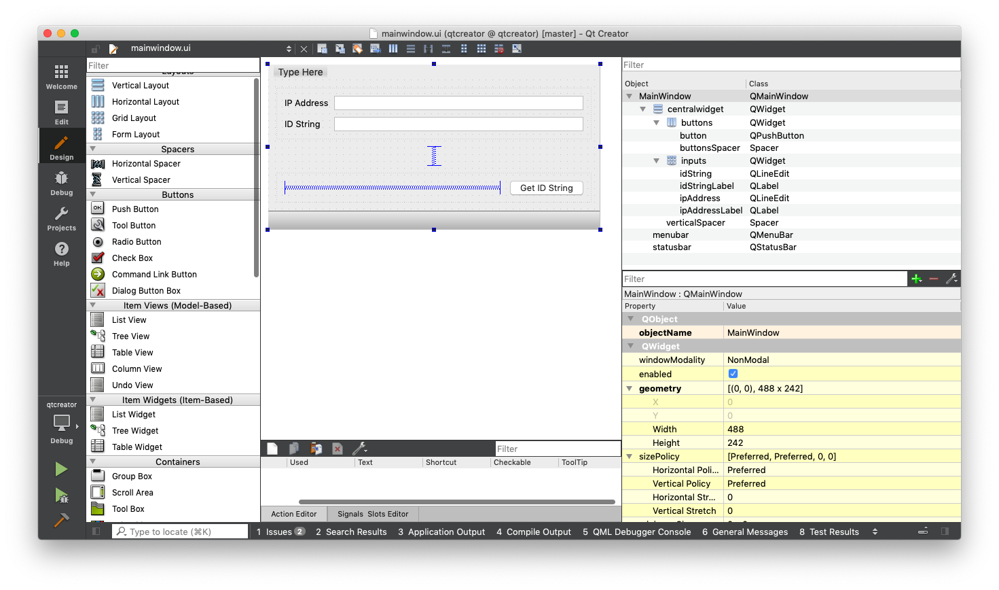
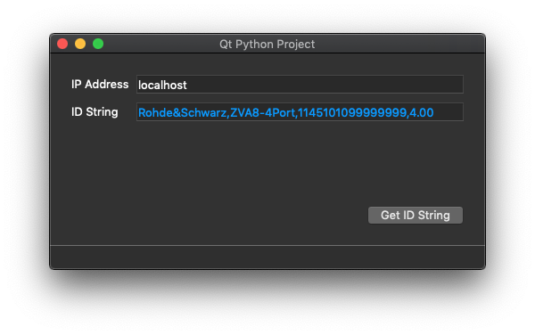

# Qt for Python Project Template

This is a model-view-controller (MVC) project template built around Qt for Python.

The goal is to create a design pattern which leverages Qt Creator while spending as little time as possible with Qt itself.

Working build scripts, built around `pyinstaller`, are included as well.

## Requirements

This project should theoretically work with a broad range of environments.

- Python 3
- packages listed in `requirements.txt`

## Recommended

This project was developed and tested with the following, more specific versions:

- Python 3.8.1
- packages listed in `requirements.txt.lock`

## Qt Creator

`MainWindow` can be opened in Qt Creator and edited graphically via the included `qtcreator.pro` project file.

More information on Qt Creator can be found here:

[Getting Started | Qt Creator Manual](https://doc.qt.io/qtcreator/creator-getting-started.html)

The corresponding python source code is automatically updated in `scripts/build`, but it can be updated without building via `scripts/update_ui`

### StyleSheet

The Qt StyleSheet located at `src/widgets/stylesheet.css` gets loaded into MainWindow at runtime.

The practical effect of this is that the current styles are not reflected in the project in Qt Creator. As a work-around, to see them in Qt Creator, copy-paste the contents of the file into the widget property directly.

## Scripts

There are bash scripts located in the `scripts` dir. They should be simple enough that, even if you are in windows, you can use them as a guide to performing the task at hand.

### `pyenv`

`scripts/uninstall` and `scripts/reinstall` require that you are using `pyenv` and `pyenv-virtualenv`, and that your `.python-version` file has the following syntax:

`python_version@environment_name`

For more information on `pyenv`, see:

[pyenv/pyenv: Simple Python version management](https://github.com/pyenv/pyenv)

## Hello World

This project template, as a way of example, provides a GUI for querying an instrument ID string.

### Getting Started

Most of the work in the application is done in `Controller.handle_button_click()`, located at `src/controller.py`. This is a good place to start to see all the pieces (Model, View and Controller) coming together.
